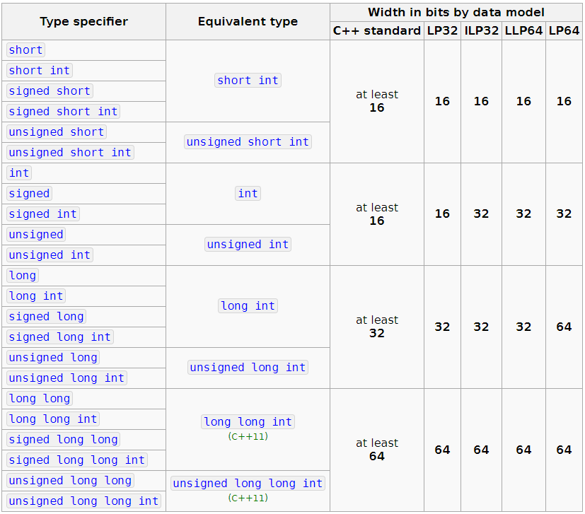
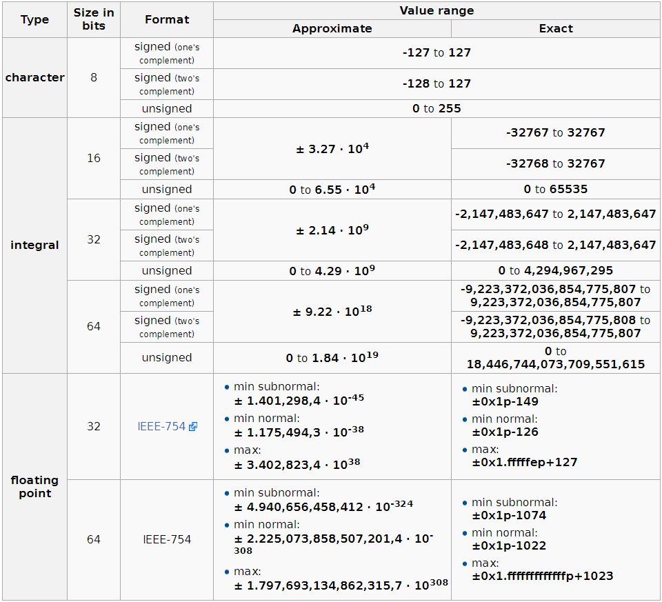

Arithmetic types can be divided into two categories: integeral types(including boolean, character and integer types) and floating types.
## Boolean type
Value: true or false (1 or 0).
The minimum size is not defined. The value of sizeof(bool) is implementation defined and might differ from 1.
## Character types
C++ provided several character types, most of them support internationlization. The basic character type is **char**, one **char** is the same size as one byte.  
Other character types are used to extend character set, like wchar_t, char16_t, char32_t. **wchar_t** type is used to ensure that any character in the maximum extended character set of the machine can be stored. **char16_t** and **char32_t** servered Unicode character set.
## Integer types
  
Besides the minimal bit counts, the C++ Standard guarantees that:
- **1 == sizeof(char) <= sizeof(short) <= sizeof(int) <= sizeof(long) <= sizeof(long long)**
## Floating point types
floating types can be further divided into three categories:  
- float
- double 
- long double

In addition, floating-point types may support special values:
- infinity (positive and negative), see **INFINITY**
- the negative zero, -0.0. It compares equal to the positive zero, but is meaningful in some arithmetic operations,(e.g.**1.0/0.0 == INFINITY**, but **1.0/-0.0 == -INFINITY**), and for some mathematical functions, e.g. **sqrt(std::complex)**
- not-a-number (NaN), which does not compare equal with anything (including itself). Multiple bit patterns represent NaNs, see **std::nan**, NAN. Note that C++ takes no special notice of signalling NaNs other than detecting their support by **std::numeric_limits::has_signaling_NaN**, and treats all NaNs as quiet.

In addition to the **real floating-point type**, we also can use **complex floating-point type** and **imaginary floating-point type**. And there are some difference between C++ and C.
- complex<float> in C++11 and float complex in C
- complex<double> in C++11 and double complex in C
- complex<long double> in C++11 and long double complex  in C 
  
 Example 1 - complex constructor 
  ```C++
#include <iostream>    
#include <complex>      

int main ()
{
  std::complex<double> first (2.0,2.0);
  std::complex<double> second (first);
  std::complex<long double> third (second);

  std::cout << third << '\n';

  return 0;
}
```
Example 2-  complex::imag 
```C++
#include <iostream>     
#include <complex>      

int main ()
{
  std::complex<double> mycomplex (20.0,2.0);

  std::cout << "Imaginary part: " << mycomplex.imag() << '\n';

  return 0;
}
```
These two types need to include **&lt;complex&gt;**, and theyr are generally not used, so just know them.

C++ Stanard specified the minimum number of significant digits in a floating point number, however most compilers achieved higher precision. Usually, **float** is represented by one word(32 bit), **double** is represented by two word(64 bit), **long double** is represented by three or four word. 

Generally speaking, we choose **double** as the type of floating-point number. Because float and double have 7 and 16 valid bits respectively, but they are almost as efficent. And **long double** is used to some hardware have some special requirements. Its use cost is relatively high.
## Range of value

- **Note:** actual (as opposed to guaranteed minimal) ranges are available in the library headers <limits.h> and <float.h>

Reference from
1. *https://en.cppreference.com/w/c/language/arithmetic_types* 
2. *http://www.cplusplus.com/reference/complex/complex/complex/*
3. *C++ Primer中文版：第5版*
